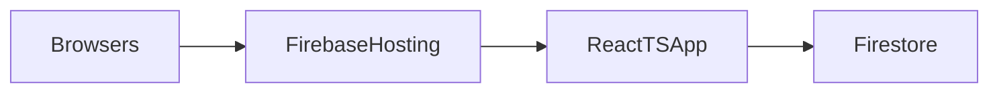

# Turn Facilitation Tool Into TS App

## Recommended stack

- Frontend: React + TypeScript with Vite.
- Styling: Plain CSS (single stylesheet migrated from the source HTML). No framework — path of least resistance.
- Hosting: Firebase Hosting.
- Shared data: Firestore with open read/write rules (fully public, no auth).

## Why this is the simplest fit

- The current tool is a single browser-only HTML page with all state held in memory in [`C:\_projects\ReWire\VivaLynx\vlx-tasks\vlx_requirements_facilitation_tool_v2.html`](C:_projects\ReWire\VivaLynx\vlx-tasks\vlx_requirements_facilitation_tool_v2.html).
- Firebase is the easiest path for your requirements because it combines deployable static hosting and realtime multi-user storage with almost no backend code.
- GCP/Firebase is materially simpler than Azure for this exact shape of app.
- No authentication is needed. The site is fully public with no per-user session data. Firestore rules are open (`allow read, write: if true`). This eliminates the Firebase Auth dependency entirely.

## Source app behavior to preserve

- Tabbed workflow: Agenda, North star, Feature sort, Open questions, Session output.
- Shared editable lists for non-negotiables, constraints, questions, risks, and actions.
- Feature board with bucket, priority, status, note editing, and domain filter dropdown.
- Generated session summary and copy/export behavior.
- Agenda tab is static content (hardcoded session schedule and expected outputs) — not persisted or editable.

## Recommended data model

Use one logical dataset named `defaultSession`, but do not store it as one giant document.

- Firestore document: `sessions/default`
  - Shared text fields: three persona texts (`personaCareRecipient`, `personaFamilyCaregiver`, `personaCoordinator`) and `successCriteria`.
  - All writes to this document must use field-level `updateDoc()` (not `setDoc()`) so that two users editing different persona fields simultaneously do not overwrite each other.
- Firestore subcollection: `sessions/default/features`
  - One document per feature so bucket, priority, status, and note updates do not conflict across users.
- Firestore subcollection: `sessions/default/items`
  - One document per question, risk, action, non-negotiable, or constraint. Each document has a `type` field discriminator.

This still gives you one shared dataset, but it is much safer for simultaneous edits than a single document.

### Seed data

The 49 features defined in the `FEATURES` array in the source HTML are the seed data. On app startup, if the `sessions/default/features` subcollection is empty, the app writes the seed features as individual Firestore documents. This is a one-time operation. Subsequent deploys do not re-seed.

## Firebase configuration

Firebase SDK config values (API key, project ID, etc.) are stored in a `.env` file at the project root, loaded via Vite's `import.meta.env`. The `.env` file is `.gitignore`'d. A `.env.example` with placeholder keys is committed for reference.

```
VITE_FIREBASE_API_KEY=...
VITE_FIREBASE_AUTH_DOMAIN=...
VITE_FIREBASE_PROJECT_ID=...
VITE_FIREBASE_STORAGE_BUCKET=...
VITE_FIREBASE_MESSAGING_SENDER_ID=...
VITE_FIREBASE_APP_ID=...
```

## App structure

- Create a Vite React app in this workspace.
- Move the hard-coded `FEATURES` seed list from [`C:\_projects\ReWire\VivaLynx\vlx-tasks\vlx_requirements_facilitation_tool_v2.html`](C:_projects\ReWire\VivaLynx\vlx-tasks\vlx_requirements_facilitation_tool_v2.html) into typed seed data.
- Build a small set of components:
  - `AppShell` for tabs and session layout
  - `AgendaTab` — static content only, no Firestore connection
  - `NorthStarTab` — non-negotiables/constraints tag lists, persona textareas, success criteria
  - `FeatureBoard` — three-column board with domain filter dropdown, click-to-cycle badges, inline note inputs
  - `RisksTab` — open questions, risks, and action items as editable lists
  - `SummaryTab` — generate, display, and copy session summary
- Add a thin Firebase data layer with realtime subscriptions (`onSnapshot`).

## Important cleanup during migration

- Normalize all editable fields into typed state and persisted records.
- Fix the current mismatch where the first persona textarea has no `id` attribute and cannot be read or persisted (the other two have `p2` and `p3`). All three get explicit, symmetric field names in the data model.
- Replace inline DOM handlers and `innerHTML` rendering with React components to avoid shared-content XSS risk.
- The source HTML uses CSS custom properties from a host environment (`--color-text-primary`, `--font-sans`, etc.) that will not exist in a standalone app. Replace these with concrete values in a standalone CSS file.
- Make the AI prompt buttons optional for phase 2; initial build should focus on the facilitation workflow and shared editing. The source `sendPrompt()` function is injected by the host environment and has no portable implementation.

## Deployment shape



## Delivery phases

1. Scaffold the React + TypeScript app, Firebase Hosting + Firestore config, `.env` pattern, and open security rules.
2. Recreate the current UX (all five tabs) and seed the existing 49 features.
3. Wire all editable sections to Firestore realtime listeners and field-level writes.
4. Add summary generation, clipboard copy, and a simple export path.
5. Deploy to Firebase Hosting and document the minimal setup steps.

## Key source reference

The current single-page app keeps all mutable data in global arrays and local variables, which is why it is not multi-user today:

```text
let features = FEATURES.map(f=>({...f}));
let currentFilter = "all";
let nn=[], con=[], questions=[], risks=[], actions=[];

function renderFeatures(){
  // ... DOM rendering ...
}

function generateSummary(){
  // ... builds plain text output from in-memory state ...
}
```

## Expected outcome

You end up with a small maintainable web app that multiple users can open at once and edit against the same shared session data, with the least operational overhead. No accounts, no auth, no per-user state.
